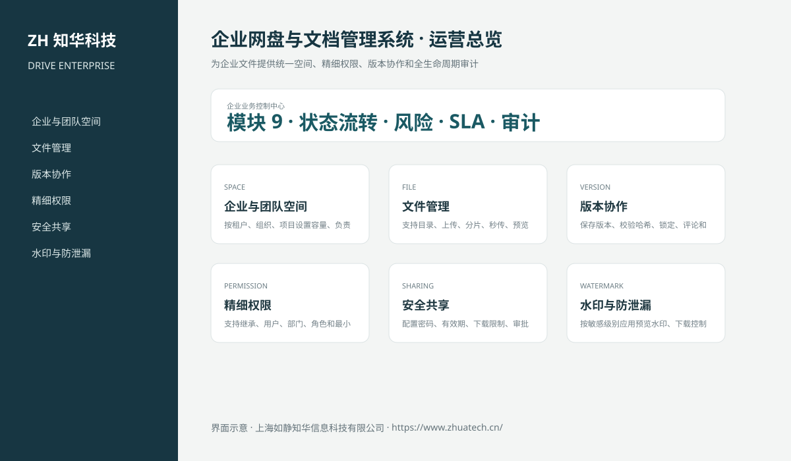
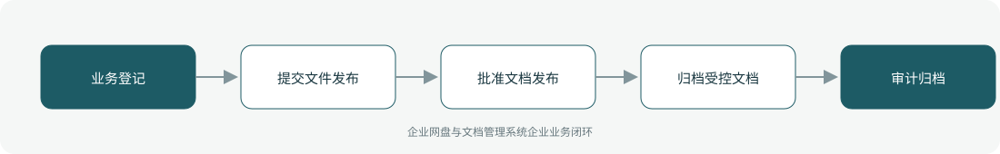

# ZhuaTech DRIVE｜企业网盘与文档管理系统

## 企业级 DLP 与外链治理

新增密级、外部分享审批、MFA、链接期限、法律保全和安全扫描控制，详见 [DLP 分享治理](docs/ENTERPRISE_DLP_SHARING.md)。

> 为企业文件提供统一空间、精细权限、版本协作和全生命周期审计

ZhuaTech DRIVE 是知华科技（上海如静知华信息科技有限公司）发布的企业级源码项目，面向“团队空间、文件、版本、在线预览、共享、权限、水印、保留、回收站、检索与审计”提供管理端与响应式业务端。工程采用前后端分离架构，所有示例数据均为虚构数据。

[知华科技官网](https://www.zhuatech.cn/) · [架构说明](docs/ARCHITECTURE.md) · [API 文档](docs/API.md) · [企业能力](docs/ENTERPRISE.md) · [测试说明](docs/TESTING.md)



## 业务模块

| 模块 | 核心能力 |
| --- | --- |
| 企业与团队空间 | 按租户、组织、项目设置容量、负责人和数据边界 |
| 文件管理 | 支持目录、上传、分片、秒传、预览、下载和回收站 |
| 版本协作 | 保存版本、校验哈希、锁定、评论和历史恢复 |
| 精细权限 | 支持继承、用户、部门、角色和最小权限控制 |
| 安全共享 | 配置密码、有效期、下载限制、审批和撤销 |
| 水印与防泄漏 | 按敏感级别应用预览水印、下载控制和告警 |
| 文档生命周期 | 执行保留、归档、冻结、到期复核和合规删除 |
| 全文检索 | 检索名称、标签、正文、所有者、版本和权限范围 |
| 访问审计 | 记录上传、预览、下载、共享、授权和删除行为 |



## 本次深化的核心文档能力

- 独立受控文档、不可变文档版本与安全共享数据模型；
- 每个版本保存 SHA-256、文件大小、变更说明、上传人和上传时间；
- 相同文档与相同哈希按幂等方式返回已有版本，避免重复版本；
- 机密/秘密文档共享强制设置 BCrypt 密码，并限制有效期与下载次数；
- 密码哈希永不返回客户端；共享访问达到次数、过期或撤销后立即失效；
- 文档归档同步撤销全部分享并阻止继续新增版本。
- 新增文档签出、签入和锁超时机制，防止多人并发覆盖同一受控文档；
- 非签出人无法覆盖处于有效锁定期的文档，签入新版本后自动释放锁；
- 管理员可在人员离岗或异常锁定时强制解锁，操作权限由服务端隔离。

## 企业级控制

- ADMIN / OPERATOR 角色边界和管理员接口隔离；
- 服务端字段、模块、唯一编号和状态迁移校验；
- 组织、期间、责任人、风险等级、到期日和 SLA 统计；
- 幂等创建、JPA 乐观锁、重复提交保护和职责分离；
- 附件 SHA-256 元数据、业务凭证完整性与全流程审计；
- 组合检索、分页、逾期筛选、UTF-8 CSV 导出和协作时间线；
- 外部系统仅预留适配器，使用方自行配置地址与凭据；
- prod profile 拒绝默认密码、弱数据库口令和本地跨域来源。

## 技术架构

- 后端：Java 21、Spring Boot、Spring Security、JPA、Bean Validation、Actuator
- 前端：Vue 3、Vite、Axios，支持桌面端与移动端响应式布局
- 数据库：MySQL 8；自动化测试使用 H2
- 交付：Docker Compose、Nginx、环境变量、GitHub Actions
- Java 包名：`cn.zhuatech.drive`

## 启动与测试

```bash
cd backend && mvn test
cd ../frontend && npm install && npm run build
cd .. && cp .env.example .env && docker compose up --build
```

开发演示账号：`admin / admin123`、`operator / operator123`。生产环境必须通过环境变量替换全部默认凭据。

## 许可与商业授权

Copyright © 2026 上海如静知华信息科技有限公司。

本工程仅允许个人学习、研究和非商业技术交流，**不得用于商业用途**。企业内部使用、生产部署、SaaS运营、项目交付、品牌替换、收费培训、咨询实施或再分发，均须事先获得上海如静知华信息科技有限公司书面授权，详见 [LICENSE](LICENSE)。

深度开发、私有化部署、系统集成与企业数字化咨询，请访问[知华科技官网](https://www.zhuatech.cn/)或扫码联系：

| 微信咨询一 | 微信咨询二 |
| --- | --- |
|  |  |

SEO：企业网盘与文档管理系统、DRIVE系统源码、企业数字化、Java企业系统、Vue管理系统、知华科技、上海如静知华信息科技有限公司。
